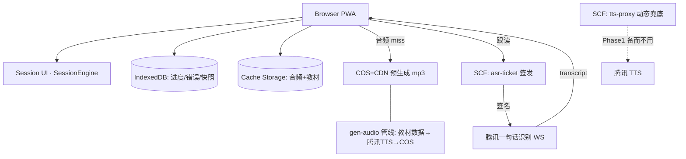
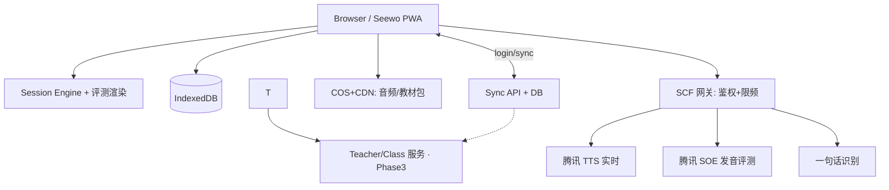

# PRODUCT-ARCHITECTURE-PLAN.md
# 英语单词/短语「听说记忆训练 Web App」· 产品与架构总规划

> 版本：v1.0（2026-08-28）
> 状态：规划稿，未写任何实现代码
> 依据：现有 `english-vocab-pwa` 代码库全量扫描 + 云厂商官方文档实时核查（附来源）

---

## 1. Executive Summary

**核心结论：不推倒重来，以现有 `english-vocab-pwa` 为基座演进。**

现有代码库已具备：React 18 + Vite + TS + Tailwind v4 + Zustand + Dexie(IndexedDB) + vite-plugin-pwa（autoUpdate SW）、三本教材数据（PEP 七上/八上、外研社高一必修一，含单词/短语/句式三层）、SM-2 SRS、Web Speech TTS（UK/US 切换）、Web Speech 识别跟读（词级比对）、错误本。技术选型全部正确，缺的是：

1. **声音的"质量层"**：Web Speech 合成音质不可控（尤其 Windows/安卓杂牌音色），需要预生成云端标准音频作为第一优先级，Web Speech 作离线/兜底。
2. **跟读识别的大陆可用性**：Web Speech Recognition 依赖 Google 服务器（MDN 明确 Chrome 为 server-based），大陆不可用 → 换腾讯云一句话识别（WebSocket + serverless 签发临时签名）。
3. **Session Engine**：现有各 View 自主决定流程，需要统一的学习会话引擎。
4. **数据模型分层**：Vocabulary 与 Curriculum 未分离映射，Word/Phrase 需拆分 mastery 维度。
5. **课堂模式**（希沃大屏）：现有 UI 是手机优先，缺大字号/键盘/触摸并列的 Classroom Mode。

**推荐组合（一句话）**：
> 纯前端本地优先 PWA + 教材音频预生成存 COS/CDN（腾讯云基础语音合成，800 万字符免费额度内几乎零成本）+ 跟读用腾讯云一句话识别 WebSocket（SCF 签发签名 URL，不放 SecretKey）+ 第一版评分如实定义为 Level 1-2（内容正确性 + 词级命中率），发音音素级评分（SOE/讯飞 ISE）放 Phase 2。

---

## 2. Product Positioning

> 围绕学生正在使用的教材，快速完成「听、认、说、写、复习」闭环的本地优先 Web App。

- 不是 SaaS、不是卡网、不是 AI 老师。打开 → 选教材 → 立刻学。
- 差异化 = **教材对齐 + 跟读反馈速度**，而非功能数量。
- 所有内部概念（SRS/ASR/Mastery）对用户不可见；用户只看到"该做什么"。

## 3. Target Users

| 用户 | 场景 | 关键诉求 |
|---|---|---|
| 初中/高中学生（主） | 手机碎片时间 + PC 写作业 | 快、反馈准、不离线断进度 |
| 教师（次） | 希沃一体机课堂带读/抽测 | 字大、按钮大、免登录、键盘+触摸 |
| 家长（间接） | 看进度 | 第一阶段不承诺，Phase 2 分享页 |

## 4. Core User Journey（首访 → 完成第一次学习）

**答案：最少 2 次点击。**

```
打开 (自动定位人教版七上，续学卡片在首屏)
 → 点「继续学习」→ 直接进入 Learning Session（第 1 步即听音）
```

- 首访无历史 → Home 显示教材选择器（折叠为一次选择：版本+年级，共 2 次点击）→ 进入 Session。
- 教材选择结果持久化到 localStorage，此后永远自动进入。
- **判断**：Curriculum/Vocabulary/Import/Settings 中，只有 **Settings 配得上页面**；Curriculum 是 Home 上的选择器组件而非独立页；Vocabulary（词表浏览）是 Unit 内的抽屉/长列表；Import 是设置页内的一个入口（Phase 1 为开发者工具性质）。

| 成为页面 | 只是 Session 内状态/组件 |
|---|---|
| Home（=续学+选教材+复习入口） | Listen/Recognition/Recall/Speaking/Spelling |
| Learning Session（全屏独占路由） | 句子练习（Spelling 的变体题型） |
| Review（复用 Session 引擎，队列为复习项） | 错词弹层、跟读反馈条 |
| Settings | 导入向导（Settings 内分步弹层） |

## 5. Information Architecture

```
/                     Home：续学卡片(大)、今日复习数、教材切换器、设置入口
/session/:unitId      Learning Session（全屏，多题型步进，可中断恢复）
/review               Review Session（引擎同上，队列为 due 项）
/vocab/:unitId        单元词表（浏览/点词听音/加入重点）
/settings             设置：口音(US/UK)、语速、课堂模式开关、离线下载、数据导出、导入
/classroom            Classroom Mode（希沃，独立布局，键盘/触摸驱动）
```

路由即页面，Session 内部全是状态机，无子路由（保证"返回"语义=退出会话并保存进度）。

## 6. UX Principles

1. **一屏一动作**：Session 内每屏只呈现当前词 + 当前题型 + 主按钮。
2. **反馈 ≤ 300ms 出现**：识别/比对结果本地即时计算，不等网络往返渲染。
3. **失败可跳过，永不断流**：任何一步失败（网络/麦克风/TTS）都有明确降级路径，绝不把学生卡死。
4. **进度即时落盘**：每完成一词即写 IndexedDB，切后台/断网/关页面零损失。
5. 克制视觉：单词和声音是主角；Liquid Glass 仅用于导航层级，不进学习区。

## 7. Mobile UX

- Mobile First：主学习流按 375px 设计，单手可达（主按钮底部安全区）。
- iOS Safari：**音频播放必须由用户手势触发**——首次进入 Session 时设置一个"开始"按钮解锁 AudioContext/speechSynthesis（现状代码已有 speak()，但需补解锁门）。
- 麦克风：getUserMedia 需 HTTPS + 权限弹窗；被拒 → 显示文字引导（iOS: 设置→Safari→麦克风）+ 提供"跳过跟读"。
- Safe Area（env(safe-area-inset-*)）、竖屏优先、横屏兼容。
- 弱网：音频走 Cache Storage 预缓存；跟读识别失败 → 降级为"自评"（我读对了/没读好，直接进 SRS q 值）。
- 微信内打开：**微信 WebView 不支持 getUserMedia**（官方只开放 JS-SDK 录音接口给认证公众号）→ 检测 UA 显示"点击右上角 → 在浏览器打开"引导页，学习功能仍可用（听/认/写），跟读禁用。

## 8. PC UX

- ≥768px：Session 居中限宽（约 640px 内容列），左右留白；键盘快捷键（空格=播放/录音，Enter=确认，Esc=跳过）。
- 键盘全操作是刚需（写作业场景）。

## 9. Seewo / Classroom UX

希沃一体机 = Windows + 可装 Chrome/Edge（希沃自带 EasiNote/白板，浏览器非定制内核，Chromium 系）。**不为它写特殊 API，只做布局模式**：

- Classroom Mode：`/classroom` 独立路由。字号 ≥ 40px、按钮 ≥ 120px、无 hover 依赖、Pointer Events 兼容触摸。
- 功能：全班跟读（大字音频波形）、随机抽词（翻牌）、听音辨词（4 选 1）、拼写挑战（拖/点字母）。
- 教师键盘控制：方向键切词、空格播放。
- 音频走教室 PC 本地缓存 + 扬声器；**不做**班级管理/账号（Phase 3）。

## 10. Learning Session Design

以场景逐帧描述：初一学生 → 人教七上 Unit 1 → 学 10 词。

| 步 | 用户看到/能做什么 | 系统状态 | 主按钮 | 次操作 | 自动推进 | 失败处理 |
|---|---|---|---|---|---|---|
| Open | Home 续学卡片：七上·Unit 1·剩余 10 词 | localStorage 读教材锚点 | 继续学习 | 换教材 | 点击进入 | 本地数据损坏→重建默认 |
| Session 进场 | 进度条 0/10，「开始」按钮（兼作音频解锁手势） | SessionEngine 初始化队列（4 新词+6 复习混排） | 开始 | 退出 | — | — |
| Listen | 大字单词 + 英/中释义淡入，自动播 1 次 US 音 | 状态=listen，音频从 Cache/CDN 取 | 再听一遍 | 换 UK 音 | 2s 后自动进 Recognize | 音频加载失败→立刻切 Web Speech 合成，无感降级；Web Speech 也失败→显示音标 |
| Recognition(认) | 看英文选中文释义（4 选 1） | 状态=recognize，计时 | 确认 | 跳过(记 q=1) | 选择即判 | — |
| Speaking(说) | 「点住说话」大按钮 + 目标词 | 状态=speak，请求 ASR 签名 | 按住说 | 跳过跟读 | 说完自动判 | 麦克风失败→权限引导+跳过；识别网络失败→自评降级；静音 5s→提示"再试一次？" |
| Feedback | 词级命中高亮（绿=对/黄=漏/红=错）+「发音准确度：内容正确 ✓」 | compareWords 本地计算 | 再来一次 | 下一个 | 合格自动 1.2s 后下一词 | 连续 3 次失败→自动回 Listen 再播 2 遍，第 4 次直接放行记 q=2（防挫败） |
| Spelling(写) | 听音拼写（播放音频，输入单词） | 状态=spell | 确认 | 看提示(首字母) | — | — |
| Next | 进度 +1，微动效 | SRS 写入 IndexedDB | — | — | 自动 | 写库失败→内存队列兜底，会话结束重写 |
| Review 段 | 队列中的 due 项同流程 | — | — | — | — | — |
| Completion | 本次成绩环：会说 x/10、记得 y/10、错词 z | 会话汇总 | 错词再练 / 收工 | 分享(Phase2) | — | — |

**允许跳过的每一步都计 q=1 进 SRS（诚实降级，不虚报掌握）。**

## 11. Speaking / Pronunciation Design（跟读交互全流程）

```
TTS标准音频(预生成) ──播放──┐
                            ▼
        [A 听标准] → [B 准备:3-2-1倒计时] → [C 录音中:波形+计时≤5s]
                            │ MediaRecorder→16k PCM
                            ▼
        [D 提交:结束即传] → ASR WebSocket 流式/一句话 → transcript
                            ▼
        [E 比对:本地 compareWords] → [F 反馈条] → [G 再来一次] → [H 下一词]
```

- **实时可行的**：录音音量波形（AudioContext AnalyserNode 本地）、倒计时、录音时长上限。
- **只能录后做的**：识别文本、词级比对（腾讯一句话识别为整句返回，非逐字流式；其"实时语音识别"可流式但短词场景无需）。
- **I. 句子 Shadowing**：整句显示 + 逐词高亮跟读；句子模式复用同一管线，比对粒度=词。
- 评分不自称"发音评分"，UI 文案：「听出来了：你说的是 ___」+ 词级命中；Phase 2 接入 SOE/ISE 后才有真·发音分数。

## 12. TTS Architecture

### 12.1 官方文档核查结论（2026-08 实查）

| Provider | 大陆可用 | en 音色(官方) | 流式 | 免费额度(官方) | 预生成文件 | Web SDK |
|---|---|---|---|---|---|---|
| **腾讯云 语音合成** | ✔ | ✔ 基础/精品/大模型音色均支持英文；**WeJames(501008) 外语男声、WeWinny(501009) 外语女声**（大模型音色，8k/16k/24k）；精品音色 WeJack(101050) 英文男声 | ✔ 实时语音合成（含 WebSocket） | **基础/精品音色 800 万字符**（一次性领取，3 个月有效）；大模型音色 10 万；超自然 2 万 | ✔ 基础语音合成 API 直接出 mp3 | ✔ 无浏览器直连需求（服务端生成） |
| 阿里云 CosyVoice | ✔ | ✔ 多语言音色 | ✔ 流式，官方称首包 ~150ms | 少量试用 | ✔ | DashScope WS |
| 讯飞在线 TTS | ✔ | ✔ 29+ 发音人 14 语种 | ✔ | 每天 500 次（SDK+WebAPI 合计），基础发音人免费 | ✔ | WebAPI/SDK |
| 百度短文本在线合成 | ✔ | ✔ | ✔ | 有试用额度 | ✔ | REST/WS |
| **Web Speech API** | ✔(合成) | 取决于系统音色（iOS/Chrome 品质可接受，安卓杂牌差） | 本地即时 | 免费 | — | 原生 |
| edge-tts 等逆向免费方案 | ✖ 不可靠 | — | — | — | — | 依赖微软未公开端点，随时失效，**生产禁用**（与本项目既有结论一致：SCF 转发只为自用兜底） |

来源：cloud.tencent.com/document/product/1073/92668（实时音色列表）、/1073/94308（实时合成：支持英语）、/1073/34112（计费：免费额度 800 万字符）、/1073/37995（基础合成）；help.aliyun.com/zh/isi CosyVoice 流式规格；xfyun.cn/doc/tts/online_tts/tts_description.html。

### 12.2 决策

**Recommendation：腾讯云基础语音合成为预生成主通道（en-US 为主），Web Speech API 为兜底与 UK 口音补充。**

- Reason：官方明确支持英文音色、800 万字符免费额度覆盖整个教材库数千倍、基础合成 API 一次性出 mp3 完美匹配预生成管线、与现有 SCF/COS 生态一致。
- **Trade-off**：腾讯未提供独立的 en-GB 音色（音色列表只有"英文"语种）→ 英式发音第一版用 Web Speech API 的 en-GB 系统音色（iOS/Edge/Chrome 桌面端质量可用），数据层 provider 抽象留好，Phase 2 可换微软 Azure（若届时引入）或评估其他厂商英音音色。
- When to Reconsider：免费额度用尽（不太可能：全库约 3000 词 × 2 口音 ≈ 5 万字符）或对音质不满意 → 升大模型音色 WeJames/WeWinny（10 万字符免费也够）。

**缓存优先架构**（教材词汇 100% 预生成，运行时 0 调用）：

```
播放请求 → Cache Storage(设备) ──hit──→ 播放
              │miss
            CDN/COS(预生成 mp3) ──hit──→ 播放+写 Cache
              │miss
            Web Speech API 合成（兜底）+ 后台触发补缓存
```

动态文本（AI 例句等 Phase 2）才走 SCF 实时合成。

### 12.3 AudioAsset 生命周期

```
pending → generating → ready → published → deprecated
                │(失败)                    ↑ 换 voice/version 后旧资源转 deprecated
                └→ failed(重试≤3)
```

AudioAsset 记录：`{ id, provider, voiceId, voiceVersion, locale(en-US/en-GB), textHash(sha1(text)), format: mp3, durationMs, cdnUrl, status }`。cache key = `tts/{locale}/{voiceId}/{textHash}.mp3`。生成脚本（Node，本地跑）读教材数据 → 批量调 API → 上传 COS → 产出 manifest.json 入库。语速变体（0.8x 慢速）第二优先级，用播放端 playbackRate 实现即可（**不预生成慢速版**，mp3 变速播放质量可接受）。

## 13. ASR Architecture

### 13.1 官方文档核查结论

| Provider | 英语 | 流式 WS | 免费额度 | 前端安全方案 | 短词适用 | 发音评测 |
|---|---|---|---|---|---|---|
| **腾讯云 一句话识别/实时识别** | ✔（eng 引擎、16k_zh_en 中英混合） | ✔ WebSocket（实时识别） | 实时识别有每月免费额度（后付费可关，控制台领取） | STS 临时凭证 / 服务端生成签名后前端直连 WS | ✔（≤60s 一句话） | **智聆口语评测 SOE：单词/句子模式，GOP 准确度+流利度，基础版套餐包 1 万次 9.9 元** |
| 阿里云 实时识别 | ✔ | ✔ WS（Token 鉴权，服务端换 token） | 有试用 | 服务端签发 Token | ✔ | 智能言语交互评测线 |
| 讯飞 语音评测 ISE（流式版） | ✔ 单词/句子/篇章 | ✔ WebAPI | 试用额度 | 服务端拼签名 | ✔ | **总分/准确度/流畅度/完整度 + 每词打分**（官方 FAQ 确认） |
| Web Speech Recognition | 依赖 Google 服务器，**大陆不可用/不可靠** | — | — | — | — | — |

来源：cloud.tencent.com/document/product/1093/48982（实时 WS：支持英语）、/1093/35646（一句话识别：支持英语）、/1093/35686（ASR 计费）、/884/19309+19327（SOE 简介/概述）、/884/44468（SOE 计费 9.9 元/万次）；xfyun.cn/doc/voiceservice/ise/ise_faq.html（题型与评分维度）。

### 13.2 决策

**Recommendation：Phase 1 用腾讯云一句话识别（英语引擎）+ 本地词级比对；Phase 2 叠加腾讯 SOE 做真实发音评分。**

- Reason：一句话识别延迟低、支持英语、与 TTS 同一账号体系；SOE 万次 9.9 元，Phase 2 成本可忽略，但 Phase 1 先用"内容对不对"验证教学价值，不先买评测能力。
- Trade-off：一句话识别≠发音质量分（只是转写），**UI 不虚标分数**（见 §11/§7）。浏览器直连 WS 需服务端签名 → SCF 签发含 expiry 的签名参数，SecretKey 永不落前端。
- When to Reconsider：若免费额度不覆盖用量（估算：每天 100 学生 × 20 词 = 2000 次/天，月 6 万次——需在控制台核对该额度数字），转 SOE 套餐包（15 万次 600 元/年）一步到位。

### 13.3 安全校验管线

```
Browser(MediaRecorder→16k PCM) → SCF(校验 origin/频率限制→生成签名参数) → 前端持签名直连
asr.cloud.tencent.com WS → transcript → 本地比对 → 丢弃音频（不落盘）
```

麦克风权限失败降级链：权限引导 → 「跳过跟读」→ 自评打点进 SRS。

## 14. Curriculum Architecture

```
CurriculumTree: region(全国/省) → publisher(人教PEP/外研社…) → grade → semester(上/下) → unit → lesson?
CurriculumMapping: { unitId, itemId, kind: word|phrase|pattern }   // 多对多
```

- 现有数据结构（`Edition { editionId, editionName, grade, volume, unit, title, words[], phrases[], sentencePatterns[] }`）已隐含此模型，**缺 Vocabulary 层**。改造：教材文件内的词条变为**引用**（wordKey），词库（Vocabulary 表）独立存放释义/音标/例句；同一词出现在多册时只存一份（例：七上 phone 与 八上 phone）。
- 教材文件保持现有 TS 模块（静态打包 + 按需 dynamic import 每册一个 chunk），Phase 2 才需要远端教材包（settings 表已预留 remote editions 键）。

## 15. Vocabulary Data Model

```
Vocabulary {
  wordKey: 'en:phone' | 'phrase:phone number'      // word 与 phrase 统一 key 前缀区分
  type: 'word' | 'phrase'
  text, meanings: [{ pos, cn }],
  phonetics: { 'en-US': '/foʊn/', 'en-GB': '/fəʊn/' },
  audio: { 'en-US': audioAssetId, 'en-GB': audioAssetId },
  examples: [{ en, cn, source? }],
  variants?: string[]           // look at / look for 归到 look 的短语族(展示关联,不强制)
}
Phrase 同构（type='phrase'，无词性字段）。
```

**Word/Phrase 分离**：学习状态、SRS、跟读管线完全同构（短语只是多词文本），数据上用 type 区分而非两张表——比对逻辑天然兼容多词。短语族（look/look at/…）在词表页做关联展示，MVP 不做"族"实体。

## 16. Learning Data Model

现有 `progress` 表（key, editionId, itemId, kind, srs, updatedAt）+ `errors` 表保留，扩展：

```
mastery: { recognize: 0-100, listen: 0-100, speak: 0-100, spell: 0-100 }  // 由 SRS 推导的派生值
attempts, correct, lastReviewedAt, nextReviewAt（srs.dueDate 即）
```

- 四维掌握度分开：**"看见知道"≠"听音辨识"≠"能说"≠"能拼"**。UI 上 Completion 页只展示四维雷达（Phase 1 可以只算数值，可视化简版）。
- `anonymousId`（crypto.randomUUID，localStorage）现在就写入每条记录，为云同步留 join 键——**仅此而已，不做账号**。

## 17. Review Algorithm

第一版：**SM-2（现有实现保留）+ 队列整形**，不做 FSRS。

- 现有 srs.ts（easeFactor/interval/repetitions，q 0-5）正确且已验证，保留。
- 加一层"每日整形"：每日新词上限（默认 10，可设置）+ 复习上限（默认 50），SessionEngine 出队时执行。
- q 值映射来自题型结果：Recognition 对=4、Spelling 对=5、Speaking 命中≥80%=4、跳过=1、连续失败=2。

## 18. Session Engine

```
SessionEngine {
  queue: Task[]              // 开场构建: due 复习优先插队 + 新词配额
  build(unitId, opts)        // 每个词派生 Task 链: listen→recognize→speak→spell
  next(): Task               // 失败重插队逻辑: fail×2 → 插 listen 重播; fail×3 → 放行记 q=2
  mark(task, result)         // 写 SRS + mastery + errors
  persist()/restore()        // 快照进 IndexedDB settings 表 → 中断可恢复
}
```

- 每题型是纯函数组件，Engine 是唯一顺序决策者（View 不自定顺序）。
- 扩展点：Task 类别注册表，Phase 2 加 sentence shadowing/听写即注册新 Task 型。

## 19-20. Offline / PWA Strategy

- **适合 PWA**（现有 vite-plugin-pwa 保留）：SW precache 应用壳；运行时缓存 `/tts/*`（Cache First）；教材 chunk（Cache First）；`/index.html` network-first+fallback。
- IndexedDB（Dexie）：进度/错误本/会话快照/词库派生表。
- 离线范围：已下载教材的 听/认/写/复习 **全离线**；跟读需在线（明确 UI 标注"跟读需联网"），离线时跟读步骤显示但提供自评降级。
- 「离线下载」按钮：设置页手动触发，逐单元预热音频到 Cache Storage（带进度条，可取消）。**不做全库自动下载**（iOS 对 SW 存储配额与清理策略不确定，尊重用户）。

## 21. Serverless Architecture

| 函数 | 触发 | 职责 | 现状 |
|---|---|---|---|
| tts-proxy | HTTP | 动态文本合成（Phase 2）/ 音频缺失补生成触发 | 现有 edge-tts SCF 可改造 |
| asr-ticket | HTTP | 校验 origin+限频 → 签发一句话识别签名（5min 有效） | 新建，~50 行 |
| soe-eval（Phase 2） | HTTP | SOE 评测代理 | — |
| sync（Phase 3） | HTTP | 云同步 | — |

**边界铁律**：学习逻辑/评分比对/进度永不过后端；后端只有"发声音"和"发凭证"。

## 22-23. Security & Privacy

- SecretKey 只存在于 SCF 环境变量（与 dayrise 同套纪律：令牌不落命令行/前端）。
- asr-ticket 加 origin 白名单 + IP 限频（防盗刷）。
- **录音即用即弃**：音频不落任何存储，转写文本仅用于当次比对，不持久化（隐私政策预留：明示"录音实时识别后立即丢弃"）。
- 未成年人最小化采集：不收集姓名/手机号/学校；不请求位置。
- 大陆部署：全静态资源走 COS+CDN（需 ICP 备案域名，沿用现有 100ye/irky 体系），SCF 同地域。

## 24. Performance Architecture

| 指标 | 目标 |
|---|---|
| 首屏 TTI（4G 手机） | < 2.0s（首 bundle gzip < 150KB，教材 chunk 懒加载） |
| 点击播放 → 出声 | **< 150ms**（Cache hit 情形） |
| 点击跟读 → 开始录音 | < 200ms（麦克风预热与权限请求在进入 Speaking 步时已发起） |
| 结束录音 → 反馈出现 | < 1.5s（一句话识别 RT ≈ 0.8-1.2s；等待期显示波形动画，不显示 spinner 死等） |
| INP | < 200ms |

关键手段：音频预取（进入词卡时 prefetch 下一词音频）、AudioContext 预解锁、ASR ticket 与录音并行请求。

## 25. Import System

- **Phase 1 格式：JSON（教材文件即 TS→可由 JSON 生成）+ CSV（教师/自用批量导词）**。列：`unit,text,type,meaning,pos,exampleEn,exampleCn`。
- 校验器（纯函数）：缺字段/重复 text（同 unit 内）/非法 key/超长文本 → 报告面板，逐条可忽略或修复；通过后进入"预览 → 生成音频任务 → 发布（写入教材数据文件，git 提交）"。
- 版本管理：教材数据进 git，editionId 带 vX；Word/PDF/拍照导入 → Phase 3（需 OCR，明显超 MVP）。
- 导入界面：Settings 内分步弹层（Phase 1 甚至是 dev-only 脚本 + 简单页面，**不必做成产品功能**）。

## 26. Audio Asset Pipeline

见 §12.3。管线脚本（Node，devDependencies，不进运行时）：读教材 → 去重（textHash）→ 并发调腾讯基础合成（en-US；en-GB 用 Web Speech 无法预生成——**en-GB 音频 Phase 1 直接不预生成**，运行时 Web Speech）→ 上传 COS → manifest 入库 → SW 缓存清单更新。

## 27. Future Account Architecture

预留：`anonymousId` 已在每条记录；`syncVersion`(每记录 updatedAt 为向量)；登录后 `POST /sync/push { records[>updatedAt] }` → 服务端按 (key, updatedAt) last-write-wins 合并 → `pull` 返回合并结果。冲突策略：学习进度 LWW 足够（无协作语义）；设备间（手机/PC/希沃）同 key 冲突取 updatedAt 大者。**Phase 3 才实现**。

## 28. Future Teacher Architecture

预留点：① progress 记录含 editionId+unitId，未来"班级作业=unitId+dueDate"直接可派生；② SessionEngine 汇总结构（completion payload）天然可作为上报单元；③ 不做班级实体表，不阻塞。**MVP 唯一要避免的**：不要把进度写死在"单设备单人"假设里（anonymousId 已解决），不要在 UI 硬编码"仅学生视角"文案于数据层。

## 29. Recommended Tech Stack（取舍结论）

| 决策 | 选择 | Reason | Trade-off | Reconsider when |
|---|---|---|---|---|
| 框架 | 保留 React 18 + Vite + TS | 现有代码已验证，迁移零收益 | — | — |
| 状态 | Zustand（保留） | 轻量、SessionEngine 可用它存会话态 | — | Redux 需求不成立 |
| 本地库 | Dexie（保留） | 已跑通，查询够用 | — | — |
| 路由 | **新增 react-router**（现状 App.jsx 自制切页） | Session/Review/Classroom 需要真路由与深链 | 少量重构 | — |
| TTS | 腾讯预生成 + Web Speech 兜底 | §12 | UK 口音依赖系统音色 | 引入 Azure 或厂商英音音色出现 |
| ASR | 腾讯一句话识别 + SCF 签名 | §13 | 非发音评分 | Phase 2 SOE |
| 部署 | COS 静态站 + CDN + SCF | 与现有腾讯生态一致 | 需备案 | — |
| 测试 | Vitest（现有 circuit-lab 经验）+ Playwright 冒烟 | 比对函数/SRS 必须单测 | — | — |
| 不引入 | PostgreSQL/Redis/MQ/微服务/K8s/AI Agent | MVP 全不需要 | — | 云同步上线时 |

## 30. Directory Architecture Proposal（增量）

```
src/
  engine/session/        # SessionEngine + task types（新增）
  lib/tts.ts             # 改造: audio-first(Cache/CDN) → Web Speech 兜底
  lib/asr/               # 新: ticket.ts + tencentSocket.ts + fallback 自评
  data/textbooks/        # 保留, 增加 wordKey 引用化(渐进)
  data/vocab/            # 词库(由教材抽取生成)
  scripts/gen-audio.mjs  # 预生成管线
  views/ClassroomView/   # 课堂模式
```

## 31. API Boundary

前端只消费三个 HTTP 端点（`GET /api/tts?hash=` 走 CDN 直链、`POST /api/asr-ticket`、Phase2 `POST /api/soe`）+ 静态资源。无其他后端依赖。

## 32-34. Phasing

**Phase 1 MVP（核心闭环，约 2-3 周当量）**
1. 词库抽取 + wordKey 重构（数据层）
2. 音频预生成管线 + COS + Cache Storage 音频层 + Web Speech 兜底 + iOS 解锁门
3. SessionEngine + 四题型串接（改造现有 View）
4. 腾讯一句话识别跟读 + 词级反馈 + 失败降级链
5. react-router 化 + Home 续学
6. PWA 离线（教材 chunk + 音频运行时缓存）
7. 复习整形（每日限额）
8. 部署 COS+CDN

**Phase 2**：SOE 发音评分（词级准确度/流利度）、句子 Shadowing 题型、CSV 导入 UI、离线下载管理器、学习报告页（家长可见的进度快照）、Classroom Mode 完整版。

**Phase 3**：账号+云同步、教师/班级作业、更多教材（远端教材包）、AI 例句（动态 TTS）。

## 35. Risks

| 风险 | 等级 | 缓解 |
|---|---|---|
| 微信内不可跟读（学生主要入口可能是微信） | 高 | 打开即检测+浏览器引导；听认写不受影响 |
| 腾讯 ASR 免费额度覆盖不确定 | 中 | 上线前控制台实测额度；超量切 SOE 套餐（成本可忽略） |
| en-GB 音色质量依赖设备 | 中 | UI 标注"英式发音由系统提供"；iOS/桌面可用性先实测 |
| iOS SW 存储被系统清理 | 低 | 进度在 IndexedDB 优先保留；音频可重下 |
| 希沃设备教室网络差 | 中 | 课堂模式课前预热缓存；断网仍可听认写 |

## 36. Open Questions（需用户拍板）

1. 部署域名：用现有 irky.dev 体系（备案情况？）还是新域名？
2. 腾讯云账号主体（个人/企业）与 SOE 额度实测；
3. 第一批教材范围：现有 3 本够否，是否优先补齐 PEP 七下/八下；
4. 每日新词默认值（我建议 10）；
5. 是否需要"教材选择"记忆多套（学生可能用两本教辅）。

## 37. ADR Recommendations（建议落档的 4 个决策）

- ADR-001：TTS 主通道=腾讯预生成，Web Speech 为兜底（本文 §12）
- ADR-002：ASR=腾讯一句话识别，评分等级诚实为 Level 1-2（§13）
- ADR-003：本地优先+anonymousId 预留，不做账号（§16/§27）
- ADR-004：教材数据静态打包 vs 远端拉取 → **静态打包**（Phase 1），远端包 Phase 2+（§14）

## 38. Implementation Order

数据层(词库) → 音频管线 → TTS 播放层改造 → SessionEngine → 跟读 ASR → 路由/Home → 离线 → 部署。每步可独立验证，UI 每 2 步冒烟一次。

## 39. Testing Strategy

- 单测：compareWords、SRS review、SessionEngine 状态机、导入校验器（纯函数全覆盖）。
- 集成：Mock ASR/音频，跑完整 10 词会话快照测试。
- 真机矩阵：iOS Safari、安卓 Chrome、PC Chrome/Edge、微信 WebView（验证降级）、希沃（课堂模式）。
- 延迟基准脚本：播放/录音/反馈三点埋点上报 console（dev 模式），验收 §24 指标。

## 40. Definition of Done（Phase 1）

1. 首访 ≤ 2 次点击进入第一个词的听音；
2. 10 词会话全流程可完成，中途断网/杀页面进度不丢；
3. 播放延迟 <150ms（缓存命中）、反馈 <1.5s；
4. 麦克风/TTS/网络三类失败均有可用降级；
5. 微信内打开有明确引导且听认写可用；
6. 希沃课堂模式可用键盘+触摸完成一节抽测；
7. 单测通过率 100%（比对/SRS/引擎）；
8. 线上 SecretKey 泄漏扫描为零（构建产物 grep）。

---

## 总架构图

**MVP 最小架构：**



**Future Full Architecture（Phase 2-3）：**



---

## 反向审查（七角色）

- **学生**："会麻烦吗？" → 不会：2 次点击开练、主按钮永远在底部、失败可跳过。风险点：跟读等待 1.5s 需要波形动画填充，否则像卡死（P1）。
- **老师**："课堂好用吗？" → 课堂模式 Phase 1 只有简版（大字跟读+抽词），完整抽测玩法在 P2；课前需预热缓存（P1）。
- **家长**："知道孩子学会没？" → Phase 1 只能看设备本地；P2 学习报告快照页（可截图分享）必须做。
- **产品经理**："太复杂吗？" → 数据层 wordKey 重构是必要的复杂；SOE/评测/班级已明确挡在 P2/P3。
- **前端工程师**："好维护吗？" → SessionEngine 单点决策+纯函数题型，可测性好；注意现有 .jsx/.tsx 双份文件需在重构时清理（P0 技术债）。
- **运维**："成本可控？" → 静态站+CDN 几乎零成本；ASR 是唯一变量，实测额度后有硬上限。
- **隐私合规**："多收数据了吗？" → 录音即弃、无账号无画像；跟读功能上线时页面需一句说明（P1）。
- **性能**："弱网好用？" → 音频缓存后全程离线可用；唯一在线依赖是跟读，已有自评降级。

**优先级汇总**：
- P0（必须）：词库重构、音频管线+缓存层、SessionEngine、跟读 ASR、降级链、.jsx/.tsx 清理、部署。
- P1（上线前补）：iOS 音频解锁、微信引导、延迟埋点、跟读隐私说明、课堂简版。
- P2（明确不做在 Phase 1）：SOE 评分、句子 Shadowing、报告分享页、离线下载管理器。
- Future：账号云同步、教师班级、AI 例句、Word/PDF 导入。

**什么现在绝对不要做**：账号/登录、班级管理、发音音素级评分包装、全库自动离线下载、AI 对话、任何永久录音存储。

---

## Recommended Next Step

**下一轮 Agent 应做的第一件事不是写新功能，而是"数据地基 + 债务清理"**：

1. 清理 src 内 .jsx/.tsx 双份文件（保留 .ts/.tsx，删除 .jsx 旧版），保证构建干净（现 tsconfig 已指向 ts 版，jsx 是死代码）；
2. 执行「词库抽取」：从三本教材 TS 文件生成 `data/vocab/` 词库 + wordKey 引用化改造（此步有现成校验可写：抽取后渲染快照对比，确保 UI 无回归）；
3. 跑通一条最小垂直切片验证两件事：**预生成 10 个词的音频上 COS 并在 iOS Safari 以 <150ms 播出**、**SCF 签发的腾讯一句话识别 WS 在 iOS Safari 麦克风下返回 transcript**。这两个是全计划仅有的外部不确定性，先用 10 个词的真实数据打穿，再铺开工程。
